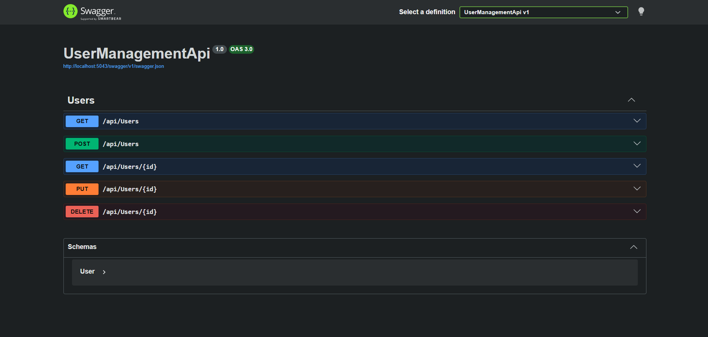
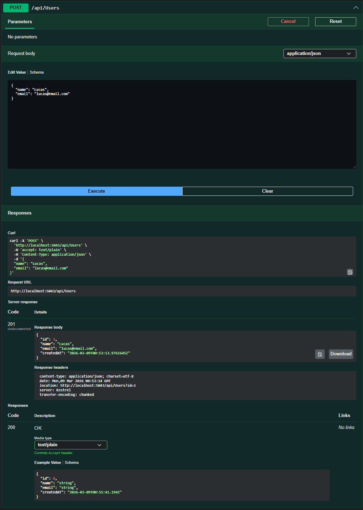
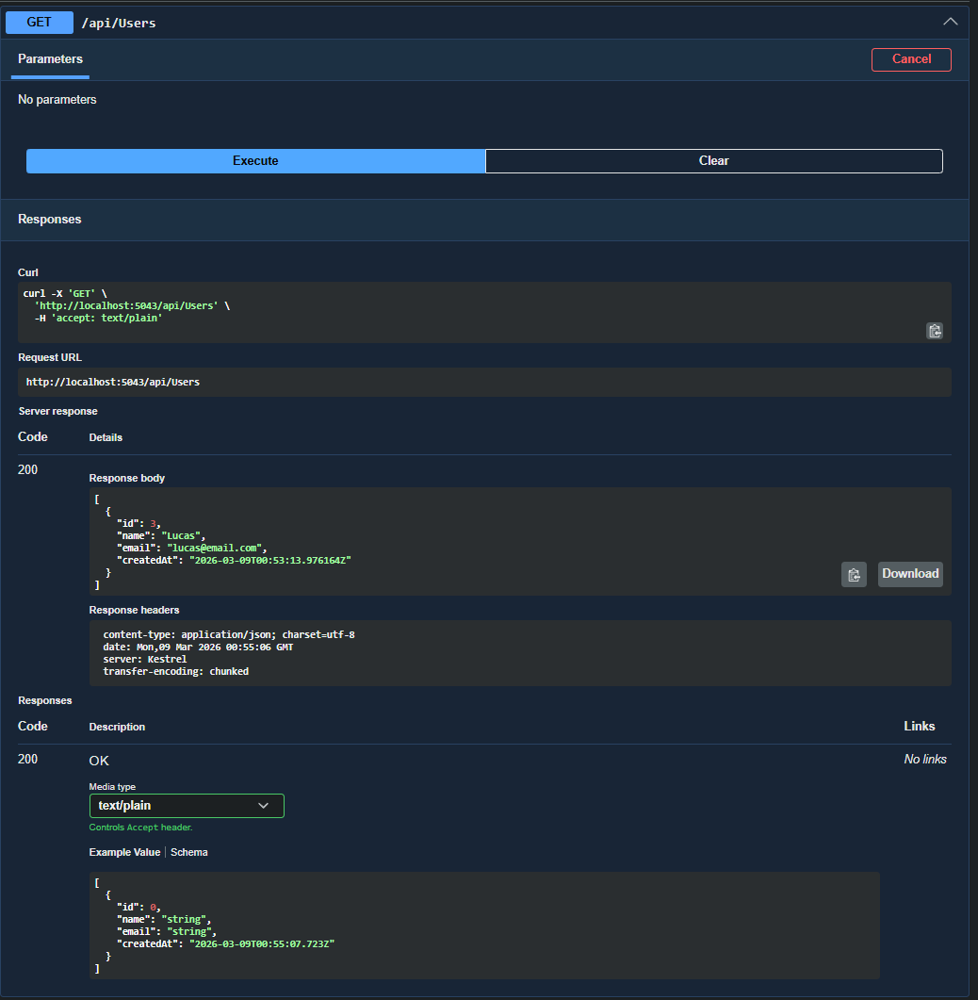

# User Management API


A simple RESTful API built with **ASP.NET Core** and **PostgreSQL** for managing users.

This project was created as a backend learning exercise to practice building APIs using **C#, Entity Framework Core, and PostgreSQL**.

---

## Technologies

- C#
- ASP.NET Core Web API
- Entity Framework Core
- PostgreSQL
- Swagger (OpenAPI)
- Git & GitHub

---

## Features

The API allows you to:

- Create a new user
- Retrieve all users
- Retrieve a user by ID
- Update user information
- Delete a user

---

## API Endpoints

| Method | Endpoint | Description |
|------|------|------|
| GET | /api/users | Get all users |
| GET | /api/users/{id} | Get a user by ID |
| POST | /api/users | Create a new user |
| PUT | /api/users/{id} | Update a user |
| DELETE | /api/users/{id} | Delete a user |

---

## Database

This project uses **PostgreSQL** with **Entity Framework Core** for database management.

The database schema is managed using **EF Core Migrations**.

---

## How to Run the Project

### 1. Clone the repository

```bash
git clone https://github.com/Lucas-aos/user-management-api-dotnet.git
```

### 2. Navigate to the project folder

```bash
cd user-management-api-dotnet
```

### 3. Configure the database connection

Edit the `appsettings.json` file and update the connection string with your PostgreSQL credentials.

Example:

```json
"ConnectionStrings": {
  "DefaultConnection": "Host=localhost;Port=5432;Database=YourDatabase;Username=postgres;Password=yourpassword"
}
```

### 4. Apply database migrations

```bash
dotnet ef database update
```

### 5. Run the application

```bash
dotnet run
```

### 6. Open Swagger UI

Access Swagger in your browser:

```
http://localhost:5000/swagger
```

---

## Swagger UI

Below are examples of the API endpoints available through Swagger.

### Endpoints Overview



### Creating a User



### Getting Users



---

## Learning Goals

This project was built to practice:

- Building REST APIs with ASP.NET Core
- Using Entity Framework Core
- Connecting a .NET API to PostgreSQL
- Implementing CRUD operations
- Using Git and GitHub for version control

---

## Author

Lucas Albuquerque
